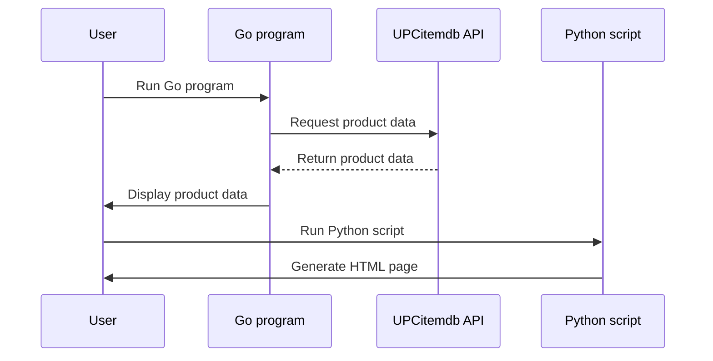

# Barcode Data Reader 📖🔍

Welcome to the Barcode Data Reader! This simple tool captures and stores barcode data via terminal input. Perfect for quick data entry or testing purposes. It can be run using either Python 🐍 or Go 🚦.

## How It Works 🚀
Terminal Input: Just type your barcode data into the terminal as if scanning a barcode. All data is saved for easy access.

### Using Python 🐍
1) Plug in your Barcode Scanner to your computer
2) Run `python barcode_scanner.py`
3) Scan a barcode with scanner
4) Check `checkout-items` dir for Data stored from scan

### Using Go 🚦
1) Plug in your Barcode Scanner to your computer
2) Run `go run main.go`
3) Scan a barcode with scanner
4) Check `checkout-items` dir for Data stored from scan

### Architecture

